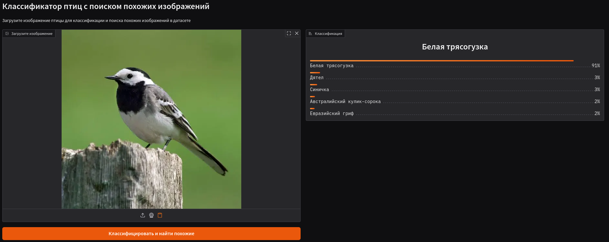
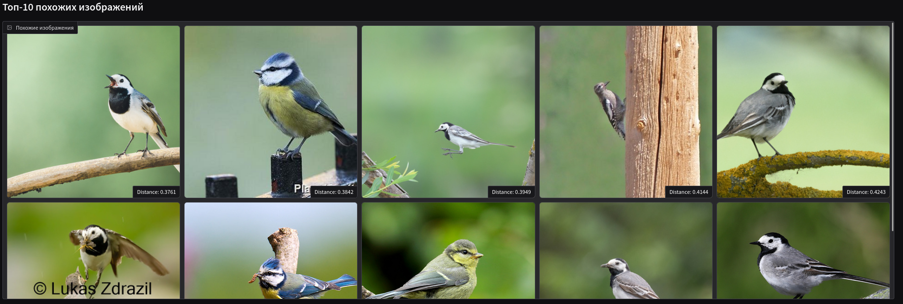
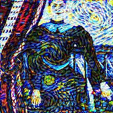

# ML Portfolio

### Практические проекты по машинному обучению и компьютерному зрению — от классического ML до transfer learning и RAG-систем.

---

## Проекты

### [Классификация физической активности по IMU-датчикам](./physical_activity_classification)

Многоклассовая классификация активности по данным акселерометра и гироскопа (100 Гц — многомерный временной ряд с сильным дисбалансом классов). Сравнение стека моделей от логистической регрессии до ансамблей: Random Forest, CatBoost, XGBoost.

`scikit-learn` `CatBoost` `XGBoost` `pandas` `numpy`

---

### [Классификация птиц + поиск похожих по эмбеддингам](./bird_classifier)

Fine-grained классификация птиц по фотографиям и семантический поиск похожих особей. Датасет собран вручную с iNaturalist. Простая CNN давала ~60% accuracy — переход на Transfer Learning с ResNet-152 поднял результат до 90%+. Управление пайплайном через DVC, демонстрация через Gradio.

`PyTorch` `ResNet-152` `DVC` `Gradio` `scikit-learn`

---

### [Neural Style Transfer](./neuro_style_transfer)

Реализация алгоритма переноса художественного стиля Gatys et al. (2015). Предобученная VGG19 извлекает контентные и стилевые признаки, оптимизация ведётся напрямую по пространству изображения.

`PyTorch` `VGG19` `torchvision`

---

### [Retrieval-пайплайн для Q&A — Хакатон Альфа-Банк](./rag_system_for_hackathon)

Retrieval-компонент для системы вопросов и ответов с метрикой HIT@5. Tiktoken для нарезки текста на чанки, bi-encoder `all-mpnet-base-v2` + FAISS для быстрого поиска, cross-encoder `ms-marco-MiniLM-L-12-v2` для re-ranking кандидатов.

`sentence-transformers` `FAISS` `tiktoken` `transformers`

---

### [RecSys youtube video>](./RecSys%20toutube%20video/) -- Work in progress

Рекомендательная система для видео с YouTube, построенная по двухступенчатой архитектуре: генерация кандидатов + ранжирование.

Данные собраны через YouTube Data API 

Содержат:
- title, description, tags, channel, просмотры, дату публикации
- Пользовательские взаимодействия (реальные или симулированные)

**Подход** \
Retrieval:
- TF-IDF + cosine similarity
- отбор ~100 кандидатов

Ranking:
- CatBoost/LightGBM/XGBoost
- учёт similarity, популярности, новизны

Метрики:
- Precision@K
- Recall@K
- NDCG@K
